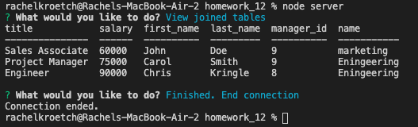

# Employee Tracker

## About
Using the command line, the user is prompted with a series of questions, allowing them to view and update values in a database containing the tables: Employee, Role, and Department.  This application was made using MySQL, Node.js, Inquirer, and JavaScript.

## Usage
To begin, the user should run "npm i" to install all needed dependancies.  A schema.sql file is provided for the user to begin their MySQL database.  Then run "node server" to begin the inquirer prompts.  Each prompt allows the user to either view a table, or add, update, or delete a table column. When the user is done, they may select "Finished. End connection" from the prompts, and the application will close.

## Screenshot

